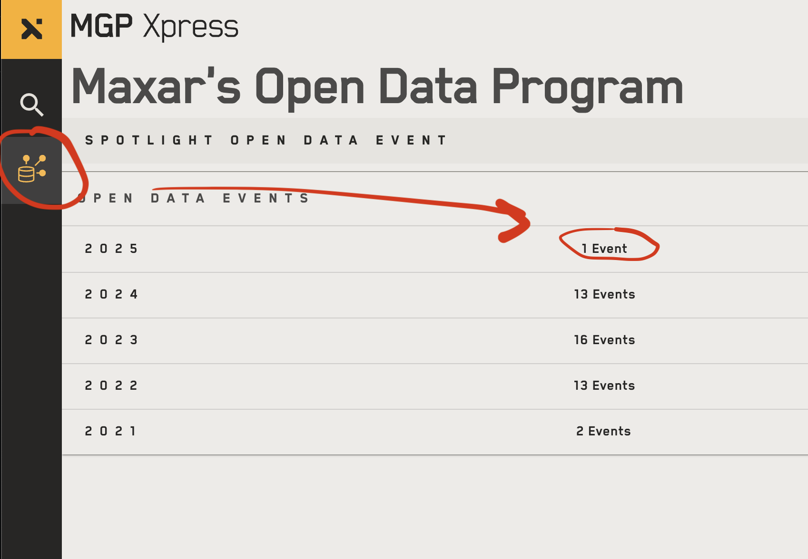

# LA fires recent satellite imagery

## ⚠️ NEWER IMAGES ARE AVAILABLE

Newer images, from 2025-01-16 and 2025-01-15 have been added to Maxar's open data. However, these cover a much larger area (much of which are not fire areas) and are like 50GB which is difficult to rehost.

### **Until I figure out a solution, please sign up for a free Maxar account (instructions below) to access more recent images.**.

Also: LAFD is conducting damage assessments of homes. More information is available at [recovery.lacounty.gov](https://recovery.lacounty.gov/)

## Friday, 2025-01-10 10:36 AM Pacific

- <a href="images/1050010040277500.html">
    🔎 Los Angeles Palisades Fire,  Friday, 2025-01-10 10:36 AM Pacific<br>
    
</a>

- <a href="images/1050010040277300.html">
    🔎 Los Angeles Eaton Fire,  Friday, 2025-01-10 10:36 AM Pacific<br>
    
</a>

---

For detailed fire information, I recommend [Watchduty](https://app.watchduty.org/).


### Updates

- 2025-01-20: Noted newer images are now available at Maxar
- Added link to [recovery.lacounty.gov](https://recovery.lacounty.gov/)
- Updated both fires to include more area, but the time the photo was taken is the same.

## Source

[Maxar](https://maxar.com/) is a company that sells various satellite photo products. They make some data available for emergency situations.

They take pictures for customers, and also apparently release open data of their choosing. I don't know or control when they update it.

The images are available from Maxar's open data with a free account, but you have to sign up and isn't super quick and doesn't work very well on the phone.

I've copied the main images here they've taken for quick reference and processed them for quick viewing.

I'm not sure if they have stopped releasing open images of this event or if there will be updated imagery in the future.

You may be able to contact them to see if they can make more imagery available, or perhaps purchase some, I'm not exactly sure.

---

### Accessing the Maxar imagery directly

Maxar has some satellite imagery of the Palisades and Eaton fires that is high resolution and is more up to date than I have found on any other services.

1. Visit [https://xpress.maxar.com](https://xpress.maxar.com) and sign up for a free account.

2. Click the "Open Data" button in the sidebar.

   

3. Choose the LA fire event.

4. Select a relevant image. Note the time and region is different, and the order of everything is kinda confusing.

5. Browse the imagery in their web view. Or you can download the original "Visual Image" of an "ARD tile" of interest. These images are gigantic and will look blurry and break most programs except Photoshop.

## Contributing
### Adding new images

Generate a dzi image pyramid with vips.

```
gdalbuildvrt my_mosaic.vrt *_visual-image.tif
gdalwarp my_mosaic.vrt final_mosaic_visual.tif -co COMPRESS=DEFLATE -co BIGTIFF=YES -multi
vips dzsave final_mosaic_visual.tif ./images/id
```

and copy and tweak the html file

Any help is welcome improving this, [make a PR or issue on GitHub](https://github.com/wilg/la-fire-maps) or [notify me somehow](http://wilgieseler.com).
